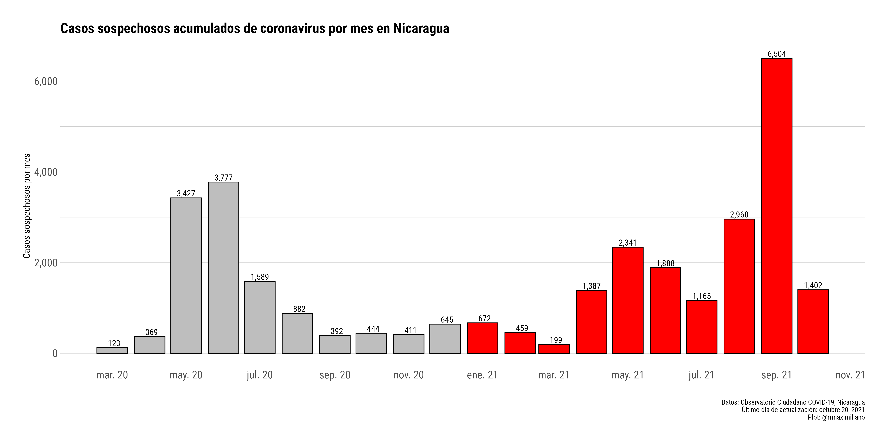
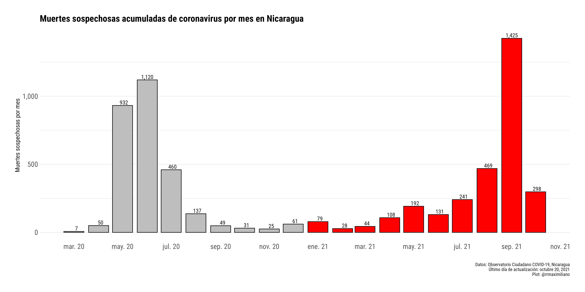
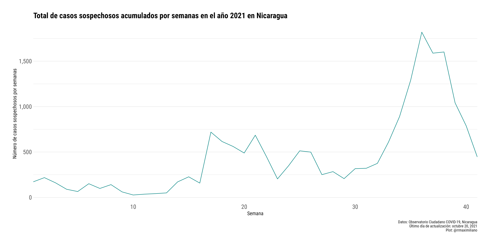
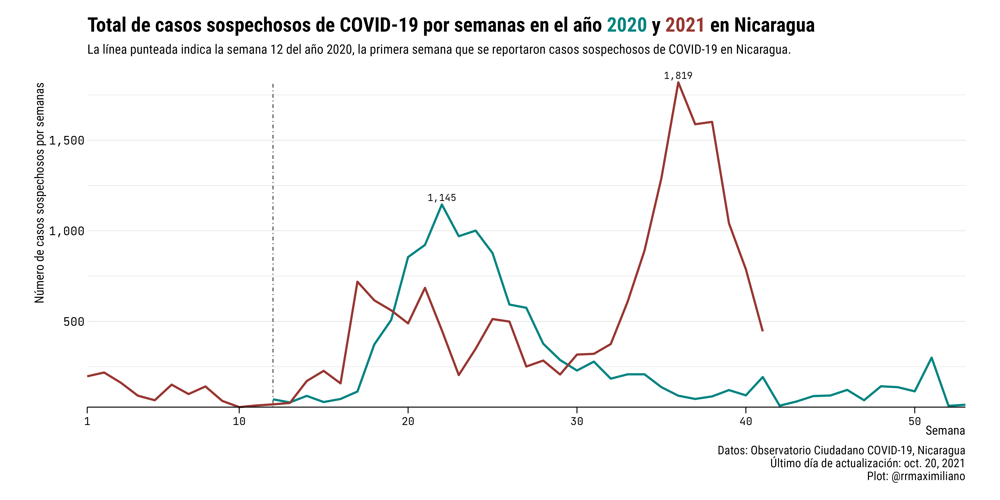

# COVID-19 Shiny App: Nicaragua

Esta shiny app tiene como objetivo presentar de manera rápida y eficiente la información de los casos y muertes acumuladas de coronavirus en Nicaragua. Esta información proviene del [Observatorio Ciudadano COVID-19 Nicaragua](https://observatorioni.org/) para los casos y muertes sospechosas, y del Ministerio de Salud de Nicaragua (MINSA) para los casos y muertes confirmadas.

En caso de requerir información sobre los casos del MINSA, sugiero utilizar la información de la [European Centre for Disease Prevention and Control](https://www.ecdc.europa.eu/). De igual forma pueden usar el paquete [COVID19](https://covid19datahub.io/index.html) en R, el cual contiene información de número de casos y muertes oficiales.

## Datos

Las siguientes bases de datos se encuentran disponibles en esta aplicación:

1. Observatorio Ciudadad COVID-19:
	* Variables: 
		- `date`: Fecha.
		- `departamento`: Departamento.
		- `cases`: Acumulado de casos sospechosos COVID-19 reportados por el Observatorio Ciudadano.
		- `deaths`: Acumulado de muertes sospechosas COVID-19 reportados por el Observatorio Ciudadano.
  
2. Ministerio de Salud de Nicaragua: 
	* Variables: 
		- `date`: Fecha.
		- `cases`: Acumulado de casos confirmados de COVID-19 reportados por el MINSA.
		- `deaths`: Acumulado de muertes confirmado de COVID-19 reportados por el MINSA.
  
3. Datos sobre vacunas:
Los datos sobre vacunas provienen de la compilación realizada por Our World in Data, en este [repositorio](https://github.com/owid/covid-19-data/tree/master/public/data/vaccinations) pueden encontrar información sobre la fuente de cada país.

4. Datos sobre personas afectadas en el sector de salud:
  * Variables: 
    - `date`: Fecha.
    - `cases`: Acumulado de casos sospechosos COVID-19 reportados por el Observatorio Ciudadano.
    - `deaths`: Acumulado de muertes sospechosas COVID-19 reportados por el Observatorio Ciudadano.  
  
## Figuras

```{r, echo = FALSE}

```

```{r, echo = FALSE}

```

```{r, echo = FALSE}
knitr::include_graphics("scrape/plots/heat_map.png")
```

```{r, echo = FALSE}

```

```{r, echo = FALSE}

```


### Comentarios y sugerencias

Para realizar comentarios o sugerencias sobre la base de datos puedes escribirme a rodriguezramirez@worldbank.org o abrir un issue en este repositorio:
<https://github.com/RRMaximiliano/covid-shiny-app/issues>
